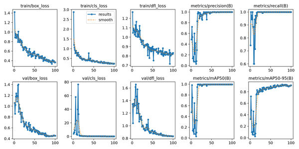

# Valorant Kill Finder

Medium Deep Learning Model and Pipeline that can identify your kills in any VOD.

  
Video from [Dacoit](https://www.youtube.com/@dacoiit). Adjusted to 1 frame/second.

## Model & Training

**Architecture & Framework**  
- **Base model**: YOLOv11m Object Detection
- **Framework**: YOLO Ultralytics + ONNX-export  

**Dataset**  
- **Total images**: 130  
  - Training: 113  
  - Validation: 12  
  - Test: 5  
- **Augmentations**  
  - Random saturation shift: −34% … +34%  

**Training Setup**  
- **Input resolution**: 640 × 640  
- **Batch size**: 8  
- **Epochs**: 100
- **Hardware**: NVIDIA GTX 1050 Ti, AMD Ryzen 9 5900X  
- **Total runtime**: ~8 hours  

**Performance**  
- **Precision**: 99.85 %  
- **Recall**: 100.00 %  
- **mAP@0.5**: 99.50 %  
- **mAP@0.5–0.95**: 91.36 %

> **Caution:** These near-perfect numbers were obtained on a tiny test set. The near-100 % precision and recall usually point to overfitting and insufficient data diversity.

I will soon add a more reliable benchmark once I find the time to annotate more data. However, the model still performs with high accuracy despite insufficient test set benchmarks.

  
Training Metrics

## Inference Performance

Benchmarked the full pipeline on a 5 min 30 s (330 s) gameplay highlight using:

- **Hardware**: NVIDIA GTX 1050 Ti, AMD Ryzen 9 5900X  
- **Model input**: 640×640 RGB frames  
- **Sampling rate**: 0.5 fps (one frame every 2 s)

| Mode             | Total Time (s) |
|------------------|---------------:|
| Single-frame     | 80.81          |
| Batch (B=4)      | 76.14          |

> **Note:** Both modes processed the video in ≈80.8 which 4× faster than playback.  
> Batches on a more powerful card will likely show better speed-ups in batch mode.  

## Architecture

### 1. Decode & Sample Frames  
- **FFmpeg** reads your video (e.g. `.webm`)  
- Optionally apply an `fps` filter (e.g. 0.5 fps → one frame every 2 s)  
- Outputs raw RGB frames via a pipe

### 2. Preprocess  
- **Read** bytes → NumPy array 
- **Resize** to `640×640` per model specification
- **Normalize** pixels to `[0,1]` and reorder to `(1,3,640,640)` for the model

### 3. Inference  
- **ONNX Runtime** session with CUDA (GPU) + CPU fallback  
- `session.run(...)` on each single frame or a batch of `B` frames

### 4. Post-process  
- Convert raw output `(1,5,N)` → a list of `[x, y, w, h, conf]` boxes  
- **Filter** by confidence threshold (currently 0.85 -> leads to a few incorrect inferences. Best -> 0.87)  
- **Non-Max Suppression** (OpenCV) removes overlapping duplicates  

### 5. Annotate & Save  
- **Draw** green boxes and confidence labels on the original frame  
- **Write** each frame as a PNG (`./debug/...`)  

## Additional Features

- **Single-frame & Batch Inference**  
- **CUDA Support**  
